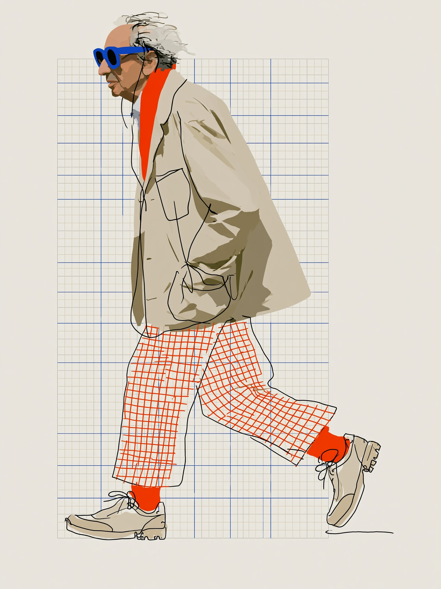

# HM Fashion Profile Skills

Two Codex image-generation skills for turning a person reference photo into a loose editorial fashion illustration built from wandering ink lines, flat color blocks, hand-drawn patterns, and a warm graph-paper composition.

本仓库包含两个 Codex 图像生成 Skill，用于把人物参考照片转译成松散的编辑感时装插画：游移墨线、平涂色块、手绘纹样与暖米白方格纸构图。

> Status: private testing. The repository is not yet intended for public distribution.
>
> 当前状态：非公开测试中，暂不建议公开分发。

## Skills

### `hm-generate-fixed-fashion-profile`

V1 keeps the bundled walking pose, wardrobe, palette, shoes, background, and composition fixed. The uploaded photo changes only the identity above the neck. An optional height value adjusts only the stylized leg-length proportion.

V1 固定模板中的步态、服装、配色、鞋袜、背景与构图。上传照片只替换颈部以上的人物特征；可选身高参数只调整风格化腿长比例。

Typical invocation:

```text
Use $hm-generate-fixed-fashion-profile with this profile photo and height_cm 180.
```

### `hm-generate-variable-fashion-profile-v2`

V2 keeps the established illustration language, walking rhythm, framing, and graph-paper background, while translating the visible clothing in each uploaded photo into the same loose line-and-color-block style. Clothing is not fixed.

V2 固定画风、步态节奏、构图和方格纸背景，但服装会跟随每次上传照片中的可见穿搭变化。V2 的核心区别是服装不固定。

Typical invocation:

```text
Use $hm-generate-variable-fashion-profile-v2 to turn this full-body fashion photo into the established illustration style. Use height_cm 170.
```

## Visual examples / 视觉范例

### V1 — fixed fashion / 固定穿搭

The elderly walking figure is the original fixed-fashion reference. V1 locks this walking rhythm, outfit, palette, shoes, graph-paper background, and loose line-and-color-block language; a new profile photo changes only the identity above the neck, plus the optional height-driven leg proportion.

下图老人行走插画是 V1 的固定穿搭基准。V1 会锁定步态、服装、配色、鞋袜、方格纸背景，以及松散线条与色块语言；新的侧脸照片只替换颈部以上的人物特征，并可按输入身高调整腿长比例。

<p align="center">
  
</p>

### V2 — variable fashion / 百变穿搭

This Haaland pair is a profile-and-height continuity example inherited from V1 and included in V2. It demonstrates identity transfer, the established illustration language, and the `190 cm → 1.20` stylized leg scale. It does **not** make the pictured outfit a V2 clothing template: in normal V2 use, clothing follows the visible outfit in each newly uploaded photo.

这组哈兰德范例从 V1 原样平移到 V2，用于承接人物侧脸、既定画风与 `190 cm → 1.20` 风格化腿长比例。它**不是** V2 的固定服装模板；正常使用 V2 时，插画服装仍会跟随每次新上传照片中的可见穿搭变化。

> Source note: The Haaland input photograph was obtained from the internet and is included only for private testing and workflow reference. Its publication rights have not been verified. Confirm permission or replace it with a licensed image before making the repository public.
>
> 来源说明：哈兰德输入照片来自网络，目前仅用于私有测试及流程参考，尚未核实公开发布权。仓库转为公开前，请确认授权或替换为具备明确许可的图片。

**Input reference / 输入照片**

<p align="center">
  
</p>

**Generated illustration / 生成插画**

<p align="center">
  
</p>

## V1 and V2 at a glance

| Feature | V1 fixed fashion | V2 variable fashion |
| --- | --- | --- |
| Person identity | From uploaded profile photo | From uploaded person photo |
| Clothing | Locked bundled outfit | Follows visible clothing in the photo |
| Walking rhythm | Locked | Style-guided and consistent |
| Background | Warm paper and graph grid | Warm paper and graph grid |
| Optional height | Supported | Supported |
| Best input | Clear left-facing profile | Clear person photo with visible outfit |

## Height variable

Both skills use `170 cm` as the visual baseline:

```text
leg_scale = clamp(1 + (height_cm - 170) / 100, 0.80, 1.30)
```

Examples: `160 cm → 0.90`, `170 cm → 1.00`, `180 cm → 1.10`, `190 cm → 1.20`.

This is an illustration proportion rule, not an anatomical measurement. 输入人物身高即可估算插画中的大概腿长比例，不代表真实人体测量结果。

## Repository structure

```text
hm-generate-fixed-fashion-profile/
├── SKILL.md
├── agents/openai.yaml
├── assets/
└── references/

hm-generate-variable-fashion-profile-v2/
├── SKILL.md
├── agents/openai.yaml
├── assets/
└── references/
```

## Installation

Copy either complete skill directory into your Codex skills directory. Keep the directory name unchanged because it must match the `name` field in `SKILL.md`.

```text
~/.codex/skills/hm-generate-fixed-fashion-profile/
~/.codex/skills/hm-generate-variable-fashion-profile-v2/
```

Restart or refresh Codex after installation if the skills do not appear immediately.

## Input guidance

- V1 works best with a clear left-facing profile. It ignores the source photo's clothing and background.
- V2 needs enough visible clothing to identify the intended outfit. If trousers, skirt, or shoes are hidden, provide another photo or a short text description.
- Height is optional; omitted height defaults to `170 cm`.
- Exact logos and unreadable text are normally simplified or omitted.

## Examples and publishing rights

The bundled examples document the accepted visual direction and the difference between fixed and variable clothing. One blond-profile example is currently marked `rights-unverified`. Confirm publication permission or replace that source image with a licensed equivalent before making this repository public.

仓库中的范例用于说明画风和版本差异。其中一张金发侧脸输入图目前标记为 `rights-unverified`；在公开仓库前，应确认发布授权，或替换为具备明确许可的图片。

## Naming

- Human-facing prefix: `HM`
- Machine-readable skill names: `hm-generate-fixed-fashion-profile` and `hm-generate-variable-fashion-profile-v2`

Codex skill names use lowercase letters, digits, and hyphens. The uppercase `HM` prefix is retained in the interface display names.
