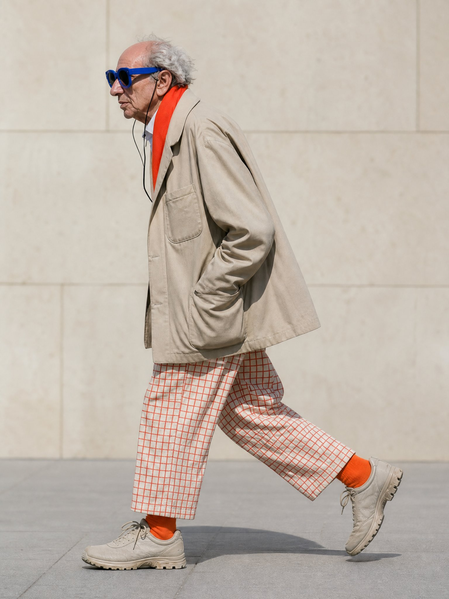

# HM Fashion Profile Skills


Two Codex image-generation skills for turning a person reference photo into a loose editorial fashion illustration built from wandering ink lines, flat color blocks, hand-drawn patterns, and a warm graph-paper composition.


本仓库包含两个 Codex 图像生成 Skill，用于把人物参考照片转译成松散的编辑感时装插画：游移墨线、平涂色块、手绘纹样与暖米白方格纸构图。

> Status: public release. The repository is available for public sharing.
>
> 当前状态：公开发布。仓库内容可公开分享。


## Skills


### `hm-generate-fixed-fashion-profile-v1`


V1 keeps the bundled walking pose, wardrobe, palette, shoes, background, and composition fixed. The uploaded photo changes only the identity above the neck. An optional height value adjusts only the stylized leg-length proportion.


V1 固定模板中的步态、服装、配色、鞋袜、背景与构图。上传照片只替换颈部以上的人物特征；可选身高参数只调整风格化腿长比例。


Typical invocation:


```text
Use $hm-generate-fixed-fashion-profile-v1 with this profile photo and height_cm 180.
```


### `hm-generate-variable-fashion-profile-v2`


V2 keeps the established illustration language, walking rhythm, framing, and graph-paper background, while translating the visible clothing in each uploaded photo into the same loose line-and-color-block style. Clothing is not fixed.


V2 固定画风、步态节奏、构图和方格纸背景，但服装会跟随每次上传照片中的可见穿搭变化。V2 的核心区别是服装不固定。


Typical invocation:


```text
Use $hm-generate-variable-fashion-profile-v2 to turn this full-body fashion photo into the established illustration style. Use height_cm 170.
```


## Visual examples / 视觉范例


### V1 — fixed fashion / 固定穿搭


V1 contains two paired examples. Both preserve the same fixed outfit, walking rhythm, palette, shoes, graph-paper background, and loose line-and-color-block language. Only the identity above the neck and the optional height-driven leg proportion change.


V1 包含两组输入/输出范例。两组都保持同一套固定服装、步态、配色、鞋袜、方格纸背景，以及松散线条与色块语言；只替换颈部以上的人物特征，并可按输入身高调整腿长比例。


#### V1 example A — elderly fixed-fashion profile / 老人固定穿搭范例（网络参考图）


**Input photograph / 输入照片**


<p align="center">
  
</p>


**Generated illustration / 生成插画**


<p align="center">
  
</p>


#### V1 example B — Haaland profile and height / 哈兰德侧脸与身高范例


This pair demonstrates identity transfer and the `190 cm → 1.20` stylized leg scale while keeping the V1 clothing template fixed.


这组范例用于展示人物侧脸替换，以及 `190 cm → 1.20` 的风格化腿长比例；V1 的固定服装模板保持不变。


**Input photograph / 输入照片**


<p align="center">
  
</p>


**Generated illustration / 生成插画**


<p align="center">
  
</p>


> 来源说明：参考输入图片均来自网络，如有侵权请告知撤换，仅作示例用。
