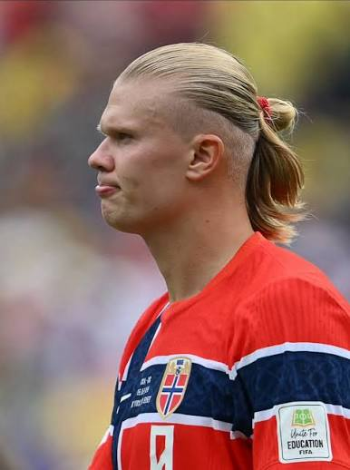
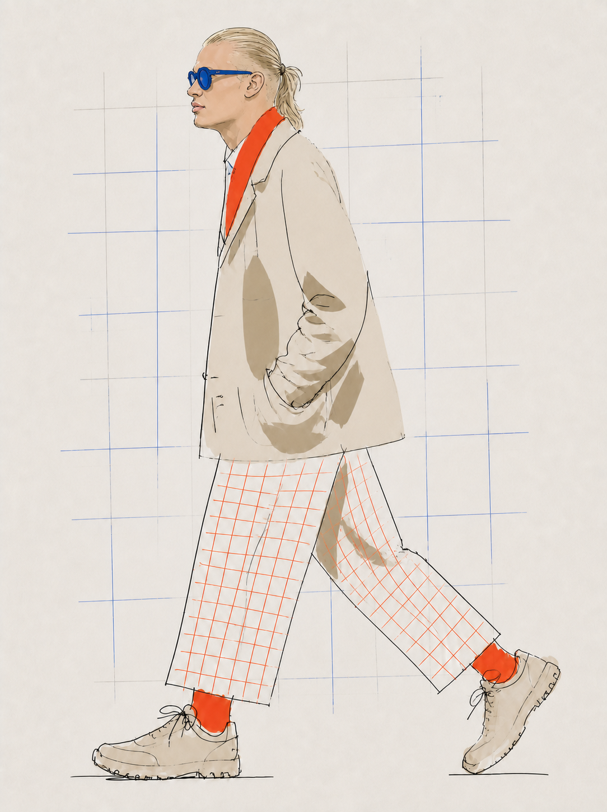

# Examples

## Height-adaptive profile example

Use this example to verify simultaneous identity replacement and height adaptation.

Prompt suggestion: include the person's height together with the profile photo. The skill will estimate a suitable leg-length proportion relative to the 170 cm template; the user does not need to calculate or specify a leg-length percentage manually. This is a visual approximation, not an anatomical measurement.

### Inputs

- Identity input: `../assets/examples/height-190-blond-profile-input-rights-unverified.jpeg`, a clear left-facing profile photograph of a clean-shaven adult with very light blond hair slicked backward into a tied ponytail
- `template_height_cm`: `170`
- `target_height_cm`: `190`
- `leg_scale`: `1.20`
- Edit target: `../assets/locked-fashion-template.png`

The identity image is bundled locally because the user explicitly requested it as the example input. Its publication rights have not been verified. Before publishing this Skill publicly, confirm permission or replace it with a licensed equivalent and remove the `rights-unverified` label.

### Reference input



### Example invocation

```text
Use $hm-generate-fixed-fashion-profile with my uploaded left-profile portrait and height_cm 190.
Replace only the identity above the neck. Keep the upper body, outfit, palette, background, and
walking gesture locked. Lengthen both thigh and lower-leg segments to 1.20 times the template
length along their existing stride directions, extend the trouser grid at the original visual
density, keep the shoe size unchanged, and keep both shoes fully visible.
```

### Acceptance criteria

- Preserve the recognizable pale blond slicked-back hair, tied tail, forehead-to-nose profile, broad jaw, and squared chin without photographic rendering.
- Preserve the original hip anchor, knee bends, stride directions, foot orientations, upper-body proportions, coat, scarf, sunglasses, socks, shoes, and background treatment.
- Make both legs visibly longer than the 170 cm template without uniformly scaling the full figure.
- Continue the trouser grid with additional irregular marks instead of stretching existing cells.
- Keep both shoes fully visible with generous top and bottom margins.

### Accepted output



This generated output is bundled as the paired visual acceptance reference.
