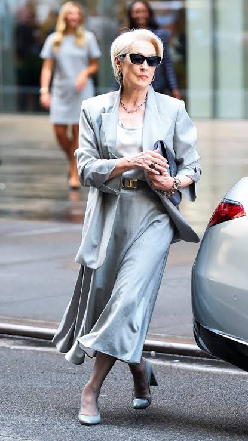
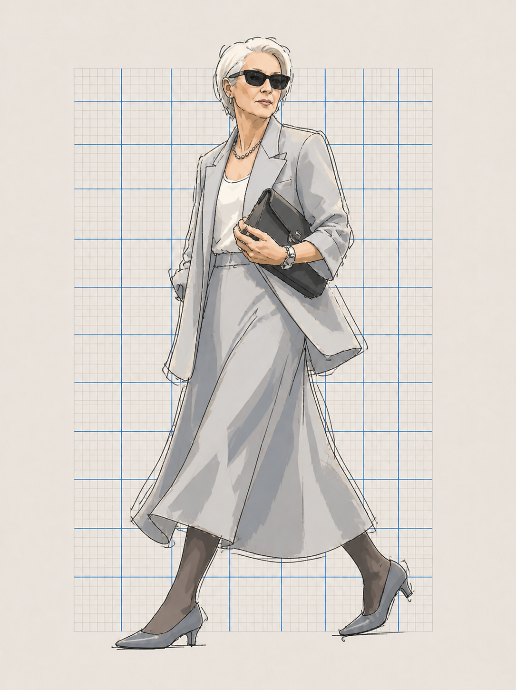

# V2 可变服装范例

V2 保留一组女性银灰套装的输入/输出范例，用于说明服装随上传照片变化。它不是固定女性模板，也不限制后续人物的性别、服装类别、颜色或配饰。

## 文件

- 输入：`../assets/examples/female-silver-suit-input-rights-unverified.jpeg`
- 输出：`../assets/examples/female-silver-suit-output.png`
- 主风格参考：`../assets/style-master-reference.png`

## 输入

输入照片提供人物身份和可见穿搭：短款向后梳的铂金色头发、黑色矩形墨镜、浅银灰色西装外套、白色内搭、长款灰色垂坠半裙、深色丝袜、灰蓝色尖头低跟鞋、深色结构感手袋和简约项链。

城市、车辆、背景路人、摄影灯光、反光和街道路面阴影都不进入插画。

## 输出

输出保留主要人物特征与服装锚点，再转译成 V2 语言：

- 细而游移的黑色墨线，夹杂重描、寻找线和越界；
- 可辨认的全身行走轮廓，局部连接不完全规整；
- 平涂的灰色与炭灰色块，配合非写实的几何阴影；
- 简化的头发、脸、手、手袋、半裙、丝袜和鞋子；
- 温暖米白色纸张和淡灰/钴蓝方格纸区域。

## 验收标准

当服装类别、层次顺序、裙摆运动、配饰和整体身份仍然可辨，而城市场景与摄影质感消失时，接受该转换。若变成写实摄影、错误采用主风格参考图中的男性固定穿搭、使用平滑时装渲染渐变，或变成厚重粉彩拼贴，则拒绝并按 V2 偏差修正规则重试。

未来输入照片显示什么衣服，V2 就按对应的服装类别、廓形和颜色进行简化线条与色块转译；女性银灰套装不会成为固定模板。

## 发布权说明

女性输入照片的公开发布权尚未核实，目前仅用于私有流程测试。仓库公开前，请确认授权或替换为具有明确许可的图片。
